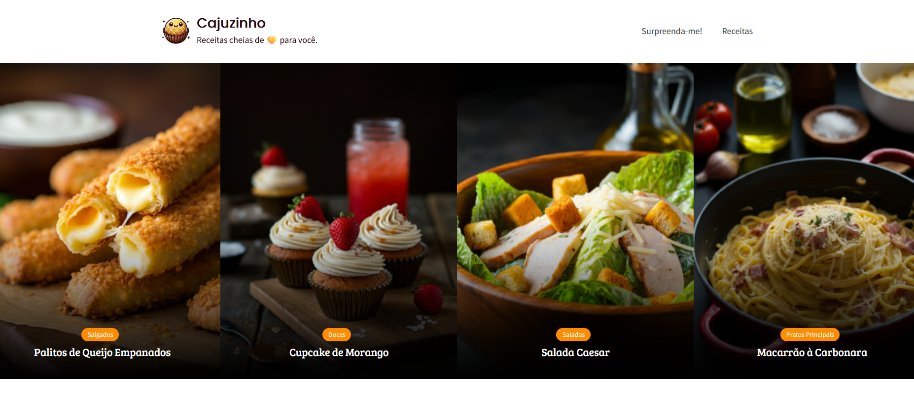

# Cajuzinho - Blog de Receitas

**Cajuzinho** é um blog de receitas desenvolvido com o WordPress, onde os usuários podem explorar receitas deliciosas de forma simples e intuitiva. O projeto oferece funcionalidades como sugestões de receitas aleatórias, bem como uma apresentação amigável para os visitantes.

## Funcionalidades

- **Receitas Populares**: Exibe as receitas mais visualizadas, com base no número de visualizações, para que os usuários possam facilmente encontrar os pratos mais populares.
- **Surpreenda-me**: Um botão que fornece receitas aleatórias para os usuários, ajudando-os a descobrir novos pratos a qualquer momento.
- **Página de Receita**: Cada receita tem uma página dedicada, com uma descrição completa, ingredientes e instruções de preparo.
- **Responsivo**: O design é totalmente responsivo, garantindo uma boa experiência de navegação tanto em dispositivos móveis quanto desktops.
- **Tema Crunchy Recipes**: Utiliza o tema Crunchy Recipes, que é simples, limpo e otimizado para blogs de receitas.

## Tecnologias

- **WordPress**: Sistema de gerenciamento de conteúdo usado para criar e gerenciar o blog.
- **PHP**: Linguagem de programação usada para desenvolver funcionalidades personalizadas no site.
- **MySQL**: Banco de dados usado para armazenar o conteúdo do blog, incluindo receitas e informações dos usuários.
- **HTML/CSS**: Estrutura e estilos usados para criar uma interface intuitiva.
- **JavaScript**: Para interatividade, com funcionalidades do blog.

## Instalação

1. Clone o repositório para sua máquina local.
2. Configure o ambiente WordPress localmente (utilizando MAMP ou outra ferramenta de sua preferência).
3. Importe o banco de dados do WordPress.
4. Instale e ative o tema **Crunchy Recipes**.
5. Ative os plugins necessários para o funcionamento do blog.
6. Configure a funcionalidade de receitas aleatórias, conforme desejado.

## Screenshot do Blog

Aqui está uma captura de tela do nosso blog de receitas:

